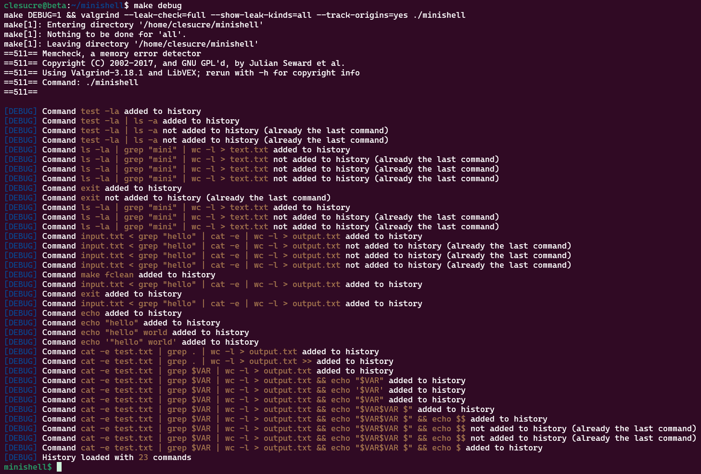
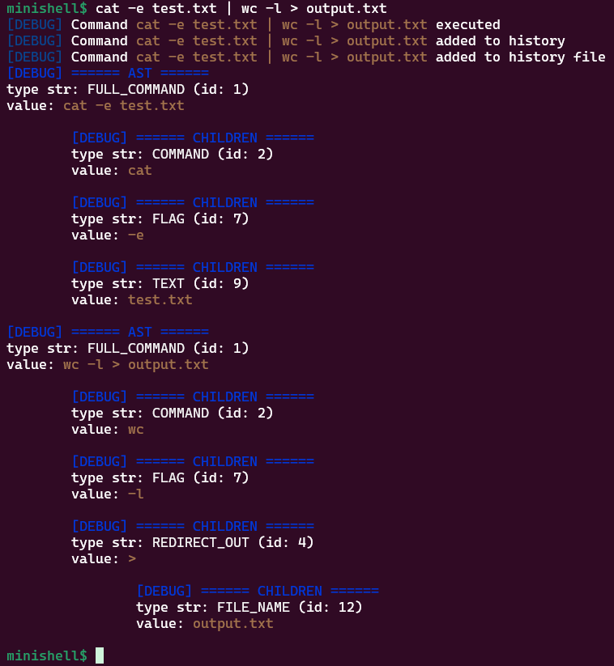

# Minishell for 42

## What is it?

Minishell is a project for the 42 school.

The goal is to create a simple shell that can run commands, handle signals, and manage environment variables.

## Subject file

The subject file is available [here](resources%2Fen.subject.pdf)

## How to use it?

#### Build and Run

```shell
make run
```

#### Run in debug mode

```shell
make debug
```

Debug mode will force relink and run the program with `valgrind` with the following options:
- --leak-check=full
- --show-leak-kinds=all
- --track-origins=yes

Our minishell also has its own debug mode that enables debug messages.





## Todo

- [x] Study termios
- [x] Study get_cursor_position
- [ ] Add perror to error handling
- [ ] Live parsing
